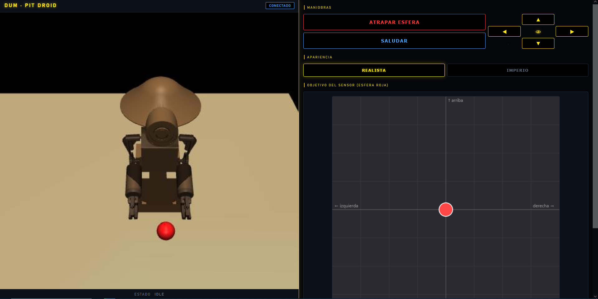
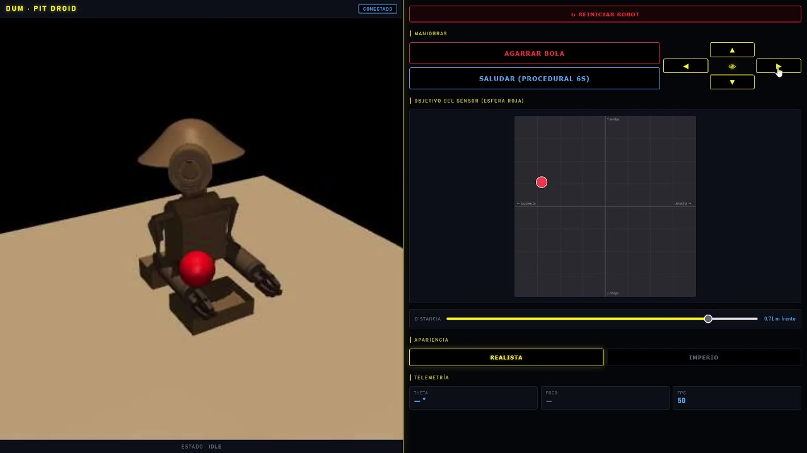
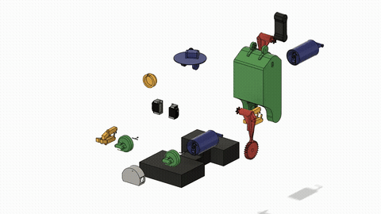

# DUM — Robot Animatrónico (Pit Droid)

**Proyecto Final — Técnico Universitario en Mecatrónica.**

DUM es un robot animatrónico inspirado en el **Pit Droid** de *Star Wars*. El proyecto
recorre el flujo profesional completo de un animatrónico: **idea → CAD → exportación a
simulador físico → control por aprendizaje por refuerzo → interfaz de control remoto**,
con horizonte de impresión 3D en PLA.

Este repositorio es el *paquete de simulación y control*: el modelo MJCF, las mallas, los
scripts de simulación/calibración, el entrenamiento RL de las policies y el motor de
animación con su web de control.

| | |
|---|---|
| **CAD** | Autodesk Fusion360 (licencia educativa) + plugin ACDC4Robot para exportar a MJCF |
| **Simulador** | MuJoCo 3.x (API Python) |
| **Control** | Reinforcement Learning — PPO (Stable-Baselines3) + animaciones procedurales |
| **Interfaz** | FastAPI + WebSocket + video MJPEG, control desde el celular (incluso fuera de la red) |
| **Plataforma** | Windows 10, Python 3 |



---

## 🎬 Demos

**Demo completa (1:32)** — head-tracking, atrapar la pelota, saludo procedural, cambio de skin
y control en vivo desde la interfaz web. *Click en la imagen para verla:*

[](media/demo.mp4)

**Vista explotada del ensamble** ([versión en video](media/explode.mp4)):



---

## ¿Qué hace?

DUM combina **policies aprendidas** y **coreografías procedurales** orquestadas por una
máquina de estados:

- **Seguimiento de cabeza** (policy `v14c`): la cabeza enfoca una pelota objetivo en todo
  el espacio, incluso *detrás* del robot, usando el yaw del cuello (`HeadRot`) en lugar de
  inclinar la base — gira para mirar atrás en vez de "doblar el cuello".
- **Atrapar al vuelo** (policy de brazo `v16_extended`): una pelota cae desde una posición
  aleatoria y el brazo la intercepta y la sostiene; incluye fase de **throw** (lanzar).
- **Saludo** (`wave`): coreografía procedural — sube la mano lento, gira la muñeca abriendo
  y cerrando los dedos, y baja.
- **Autofoco del lente**, **cambio de skins** (Rebelde / Imperio) y **cámara controlable**
  desde la web.

---

## Estructura del repo

```
DUM_MJC/
├─ Cuerpo/                      # Modelo físico
│  ├─ DUM4.xml                  #   MJCF principal (13+ actuadores, equalities leva→dedos)
│  ├─ DUM4_grab.xml             #   Variante para entrenar el "atrapar" (pelota + sites)
│  ├─ DUM4unarticulated.xml     #   Variante de referencia
│  └─ meshes/*.stl              #   21 mallas de los links (escala mm→m)
│
├─ Scripts/
│  ├─ calibracion.py            # Grid search paralelo de PID por actuador (multiprocessing)
│  ├─ benchmarks.py             # Pruebas de estabilidad / integradores / throughput
│  ├─ forzar_motores.ipynb      # Notebook tutorial / banco de pruebas
│  ├─ rl_env.py                 # Env Gymnasium de head-tracking
│  ├─ train_ppo.py / eval_ppo.py
│  ├─ eval_v14_head.py          # Eval del seguimiento (400 steps, incluye "mirar atrás")
│  ├─ rl/                       # Paquete RL del "atrapar"
│  │  ├─ envs/grab_env.py       #   Env de atrapar/lanzar
│  │  ├─ train_grab.py          #   Entrenamiento con curriculum
│  │  ├─ eval_grab.py
│  │  └─ procedural/wave.py     #   Coreografía del saludo
│  ├─ skins.py                  # Skins Rebelde / Imperio (modifica geom_rgba en vivo)
│  ├─ run_animation_engine.py   # ★ Motor de animación: integra todo + sirve la web
│  ├─ web_remote/               # Backend FastAPI + frontend (HTML/JS/CSS)
│  ├─ rl_env_multitask.py       # Exploración multitask (línea abandonada, ver history)
│  └─ gen_anexos_pdf.py         # Genera los PDFs de Anexos de código
│
├─ runs/                        # Policies finales versionadas (resto ignorado por peso)
│  ├─ grab_phase1_v16_extended/ #   Policy de brazo (final.zip + vecnormalize.pkl + video)
│  └─ ppo_dum_v14c_aggressive/  #   Policy de cabeza (final.zip + video)
│
├─ Anexos/                      # PDFs de código para la presentación final
├─ docs/
│  ├─ history.md                # Bitácora completa del desarrollo (cronología + rewards)
│  └─ planificacion/            # Planes y diseños de reward (Plan A/B, sprints)
│
├─ run_demo.ps1                 # Lanzador de demo (auto-reinicio + túnel Cloudflare)
├─ README_DEMO.md              # Guía de la demo y acceso remoto
└─ CLAUDE.md                    # Convenciones del modelo MJCF y reglas de trabajo
```

---

## Puesta en marcha

> **Requisito (todas las partes):** todas las rutas del proyecto son **relativas a la raíz
> del repo** (la carpeta del git) — no hay rutas absolutas hardcodeadas. Salvo el notebook,
> **cada parte se ejecuta parado en la raíz del repo**. Más abajo se indica el directorio de
> trabajo requerido por cada parte.

```powershell
# 1) Crear entorno e instalar dependencias  ── correr desde: raíz del repo
python -m venv .venv
.\.venv\Scripts\Activate.ps1
pip install -r Scripts/requirements.txt
```

Dependencias clave: `mujoco`, `stable-baselines3[extra]`, `gymnasium`, `fastapi`,
`uvicorn`, `imageio[ffmpeg]` (ver `Scripts/requirements.txt`).

### Ver el modelo · *correr desde: raíz del repo*

```powershell
# Visor de MuJoCo: arrastrar Cuerpo/DUM4.xml sobre simulate.exe
python -m mujoco.viewer --mjcf Cuerpo/DUM4.xml
```

### Correr la demo (motor de animación + web) · *correr desde: raíz del repo*

```powershell
# Opcion simple (recomendada): auto-reinicio + tunel remoto si hay cloudflared
pwsh ./run_demo.ps1

# O directo:
python Scripts/run_animation_engine.py              # con viewer local
python Scripts/run_animation_engine.py --no-viewer  # headless (solo web)
```

Luego abrir **http://localhost:8000**. Para acceso desde el celular en la misma Wi-Fi o
desde fuera de casa, ver **[README_DEMO.md](README_DEMO.md)** (incluye Cloudflare Tunnel y
solución de problemas de DNS).

### Entrenar / evaluar · *correr desde: raíz del repo*

```powershell
# Cabeza (head-tracking)
python Scripts/train_ppo.py
python Scripts/eval_v14_head.py

# Brazo (atrapar/lanzar)
python Scripts/rl/train_grab.py
python Scripts/rl/eval_grab.py

# Calibración PID clásica (sin RL)
python Scripts/calibracion.py
```

### Notebook tutorial · *correr desde: `Scripts/`*

```powershell
# El notebook usa rutas relativas a Scripts/ (ej. ..\Cuerpo\DUM4.xml)
jupyter notebook Scripts/forzar_motores.ipynb
```

---

## Convenciones del modelo

El detalle completo está en **[CLAUDE.md](CLAUDE.md)**. Lo esencial:

- **Ángulos en radianes** (`<compiler angle="radian"/>`); Fusion360 trabaja en grados, se
  convierte a mano al editar el XML.
- **Mallas en metros** (STL en mm, `scale="0.001 0.001 0.001"`).
- **Nomenclatura** `[Lado][Parte]_[tipo]` — ej. `RightTopFinger_joint`, `act_RightWrist`.
- **Mecanismo leva→dedos** modelado con `<equality>` lineal (`polycoef`), porque el
  exportador no preserva la relación mecánica.
- **13 actuadores de posición** dimensionados según servos reales (DS3218 / MG996R / MG90S).

---

## Notas

- **Aprendizaje vs. realidad:** atrapar al máximo alcance estático tiene un techo honesto
  (~3/12 deterministas); el seguimiento de cabeza funciona en 360°. La bitácora documenta
  los intentos fallidos y por qué (catastrophic forgetting, curriculum, etc.).
- **CPU > GPU** para esta `MlpPolicy`: la recolección de experiencia paralela en CPU rinde
  más que la GPU en este setup.
- Los **checkpoints intermedios, logs y tensorboard** (~800 MB) **no** se versionan; el repo
  incluye solo las policies finales que usa la demo. La cronología de cada versión está en
  [`docs/history.md`](docs/history.md).

---

## Herramientas

El diseño, las decisiones de ingeniería y la dirección del proyecto son propios. Durante el
desarrollo se usó **Claude Code** como asistente de programación: para acelerar el shaping de
las funciones de reward y los ciclos de iteración del RL, depurar el modelo MJCF, armar el
backend/frontend de la web de control y mantener la documentación (`docs/history.md`, Anexos).
La validación, calibración y los criterios de aceptación quedaron siempre del lado humano.

---

## Licencia y aviso legal

Licenciado bajo la **[PolyForm Noncommercial License 1.0.0](LICENSE)**: libre para usar,
estudiar, modificar y **probar con fines no comerciales**; **no** se permite el uso comercial
ni la venta. La licencia cubre solo el trabajo propio del autor (código, CAD, mallas,
simulación, rewards, policies, web).

> ⚠️ **Proyecto académico no oficial.** *Star Wars*, *Pit Droid* y las marcas/diseños
> relacionados son propiedad de **Lucasfilm Ltd. / Disney**. Sin afiliación ni respaldo.
> La licencia de este repo alcanza solo el aporte del autor y **no** otorga derechos sobre
> esa IP de terceros. Ver **[NOTICE](NOTICE)**.

---

*Proyecto Final de la carrera Técnico Universitario en Mecatrónica.*
